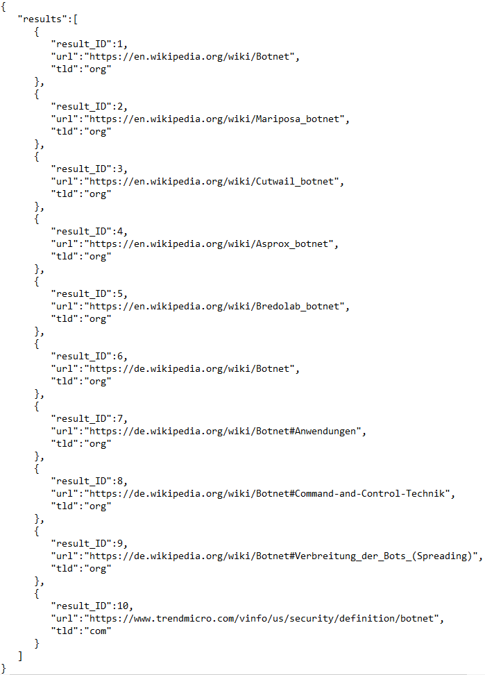

# Google Search

## Short description: 
- This app process's incoming **GET**- and **POST**-requests over an endpoint
- **GET**-requests will lead to a web application server
- **POST**-requests will be 
  - checked for authentification with a fix username and password  
  - if authentification success's the first 10 Google results will be returned for a variable keyword extracted from the POST-request   
  - As a result a **JSON** string will be returned as a list of result objects with its position, url and top domain level

### Testing: 
- For testing **GET**-request: start endpoint.py and call http://127.0.0.1:5000/  
- For testing **POST**-request: start endpoint.py, create and send a POST-request according scheme:   
  - (http://127.0.0.1:5000/, data = {'keyword': '  ', 'username': '  ', 'password': '  '}) 
  - variable keyword e.g. Botnet  
  - username = East  
  - password = West  
  - **POST**-request create example: requests.post(url, data=payload) with payload = {"keyword": "Botnet", "username":"East", "password":"West"}  
  - Sending **POST**-requests with **Postman** https://www.postman.com/downloads/  

### JSON scheme and example:
  - Keyword: **Botnet**

